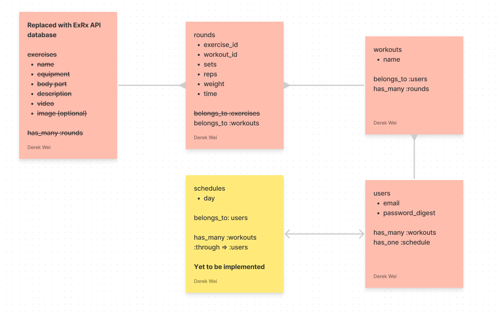

# Fitter - A fitness routine planner

## About

Fitter is a web app that lets users search different type of exercises and create workouts. Users can also keep track of their workout and running schedules. I created the app to demonstrate a CRUD application for Project 1 of the General Assembly software engineering course. You can demo it [here](https://fitnessplannerapp.herokuapp.com/).

## Instructions

1. Go to https://fitnessplannerapp.herokuapp.com/token to retrieve API token for 1 hour (this will allow you to access workouts despite showing an error page)
2. Go to the [main page](https://fitnessplannerapp.herokuapp.com/) and create an account with email and password.
3. Click 'Create Workout' in the navbar and choose a name for your workout.
4. Add new exercise and search by the 'Equipment' and 'Body Part' inputs. DO NOT use the 'Exercise Name' search input as it is currently broken.
5. Choose an exercise and include sets, reps, time or weight. Add exercise to the workout.
6. Repeat steps 4-5 until the desired exercises are in your workout.
7. You can access your new workout in 'Workouts' on the navbar. Descriptions for each exercise will be visible in the workout.

## Technologies used

- Ruby 2.7.4
- Rails 5.2.6
- Bootstrap
- [Animate.css](https://animate.style/)
- Heroku
- [ExRx API exercise database](https://exrx.net/Store/Other/Licensing)
- Bcrypt gem - for user authentication

## Models

- Initially created with four models - exercises, workouts, rounds and users
- Replaced exercise model with ExRx exercise database API
- Schedule model to be implemented

## Bugs to fix
- API token is not being automatically accessed and stored in cache so it requires manual reloading through the /token route.
- Pages with the 'Go Back' do not go up the route structure and instead returns to the previously accessed page which can cause confusion while editing workouts
- Workouts with identical names can be created - this should not be allowed
- Searching by exercise name is currently broken - user inputs return no results
- Fix the sets and reps display for workouts when no sets or reps are added

## Features to add
- Running - integration with Strava API to pull in run data from users
- Schedule - shows the days of the week and the user selects workouts to be scheduled on certain days
